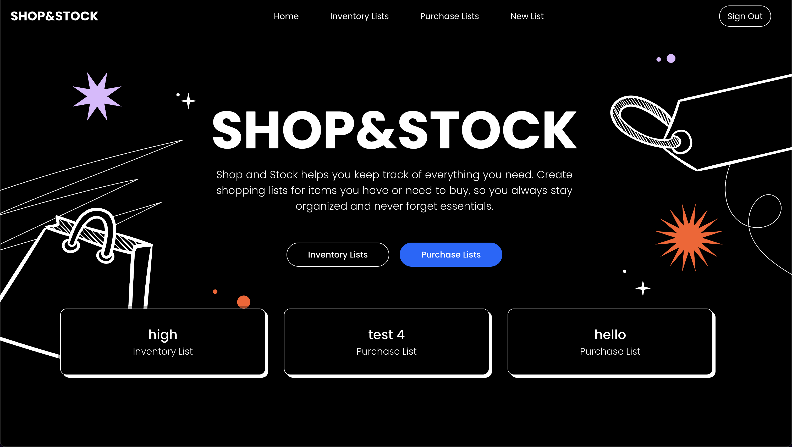

# Shop & Stock 🛒

> **Shop & Stock** is a user-friendly app designed to help you manage your shopping lists and track your inventory effortlessly. Whether you're planning your next grocery run or keeping an organized record of household items, this app ensures you never forget what you need.  

## Why We Built This App  

> We created **Shop & Stock** because we believe it offers a practical solution for users who want to stay organized. By providing an easy way to create shopping lists and inventory records, the app helps streamline day-to-day shopping and household management.

----------

## Getting Started

[Deployed App Link](https://shop-and-stock-front-p29rnernm-abdulla-sameer-alheelas-projects.vercel.app/)

[Back-End Repository Link](https://github.com/Abdulla-ALheela/shop-and-stock-back-end)

[Planning Documents Link](https://trello.com/b/thMs2gh4/shop-stock)

----------

## Attributions

-   [Poppins font](https://fonts.google.com/specimen/Poppins)
-   [CSS made by Håvard Brynjulfsen](https://codepen.io/havardob/pen/qBXZPRE)

----------

## Technologies Used

-   HTML
-   CSS
-   JS
-   Node.js
-   Express
-   MongoDB
-   Mongoose
-   React
----------

## Next Steps

-  Enable users to attach item images for better reference and documentation.
-   Performance optimization
-   Implement search for quick item lookup.
-   Add category-based filtering (e.g., groceries, electronics, household essentials).
-   Allow users to scan barcodes for quick item addition.
-   Set expiration date reminders for perishable items.
-   Get notified about low-stock items.
-   Share shopping lists with family, friends, or roommates.

----------
